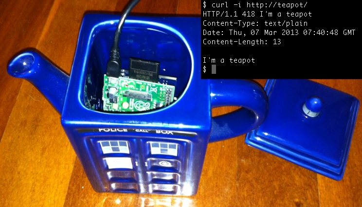

This is an HTTP Teapot Server used to avoid confusing HTTP-enabled teapots with HTCPCP devices on the same network. The HTTP Teapot Server will respond to HTTP or HTCPCP requests with the HTTP error code 418: I'm a teapot. For more information on the HTCPCP (based on HTTP), see <a href="rfc2324.txt">RFC 2324 (1998)</a>. Chapter 2.3.2. outlines the use of this particular HTTP error code for the disambiguation of teapots from HTCPCP entities.

An implementation of TEA [1] is also included, to be used in future enhancements of this project.

For use with a teapot using a Raspberry Pi (or similar) controller.

Example use case (may also be used with shorter and stouter varieties):

This project requires libevent to build (on Debian/Rasbian one can normally use <code>sudo apt-get install libevent-dev</code> to install this dependency)

[1] Wheeler, D. Needham, R. <i>TEA, a Tiny Encryption Algorithm.</i> (1995)
